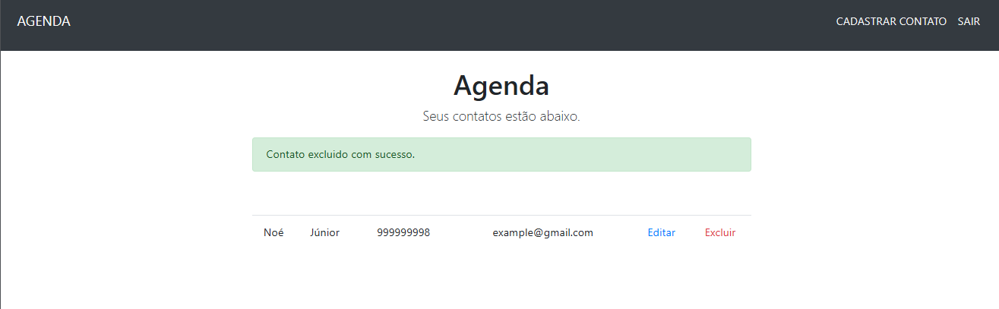

# Gerenciador de Contatos 🤳🏿

Um simples sistema de gerenciamento de contatos utilizando Node.js e MongoDB. Este projeto permite a criação, leitura, atualização e exclusão (CRUD) de contatos, armazenando informações como nome, sobrenome, email e telefone.

# Screenshot 🌇

